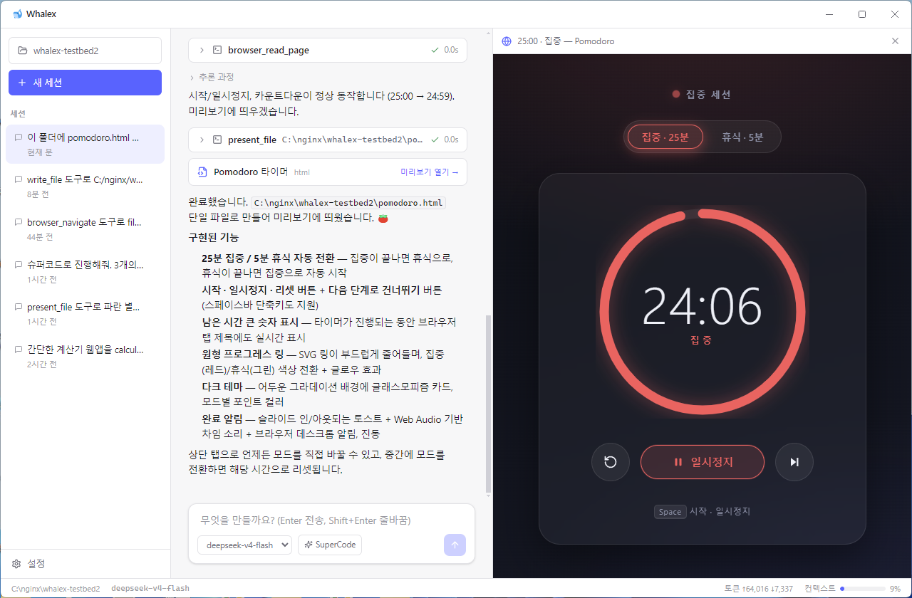
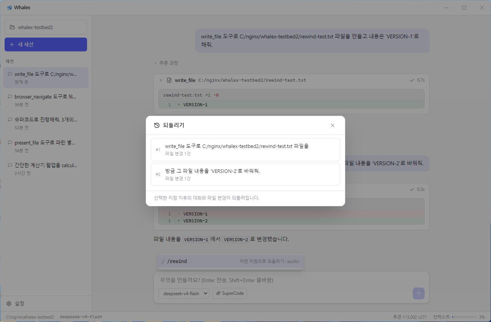
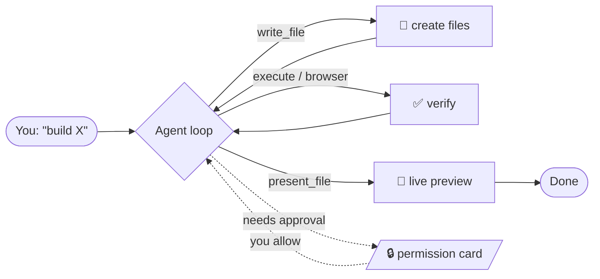

<div align="center">


### A local coding-agent desktop app, powered by DeepSeek

Like **Claude Code** / **Codex** — but it runs on your own DeepSeek key.
Reads, edits and runs code in a folder on your machine, and shows you what it built in a live preview.

[](https://github.com/DataHanyang/whalex/releases)
[](LICENSE)
[](https://github.com/DataHanyang/whalex/releases)
[](https://platform.deepseek.com)
[](#-languages)

**English** · [한국어](#-한국어-요약)

<br>



<sub><em>"Build a Pomodoro timer and open it in the preview" → writes the file, verifies it in a browser, and shows it — in one request.</em></sub>

</div>

---

## ✨ What it does

<table>
<tr>
<td width="33%" valign="top">

**🛠 Local control**
Read / write / edit files, run PowerShell &amp; bash, `glob`, `grep`, `web_fetch` — right in your project folder.

</td>
<td width="33%" valign="top">

**🎨 Artifact preview**
Renders the HTML / SVG / Mermaid / Markdown the agent creates in a split panel — no leaving the app.

</td>
<td width="33%" valign="top">

**🌐 Browser use**
The agent opens and reads pages via the DOM, so it can build &amp; test web apps despite DeepSeek being text-only.

</td>
</tr>
<tr>
<td valign="top">

**🤖 Sub-agents &amp; SuperCode**
Delegate to a sub-agent, or fan out a whole fleet of agents in parallel.

</td>
<td valign="top">

**🎯 Goal mode**
Give a goal; it iterates on its own, self-evaluating until the goal is met (Codex-style loop).

</td>
<td valign="top">

**⏪ Checkpoints &amp; rewind**
`/rewind` restores files **and** the conversation to any earlier point.

</td>
</tr>
<tr>
<td valign="top">

**🔌 MCP · Skills · Plugins**
One-click MCP presets, `SKILL.md` skills, git/local plugins, and Hooks.

</td>
<td valign="top">

**🖼 Vision bridge**
Paste an image → a vision model describes it → injected into context.

</td>
<td valign="top">

**⚡ Fast &amp; auto-updating**
Parallel read-only tools (~2.75×), rate-limit retries, in-app auto-update.

</td>
</tr>
</table>

## 📸 In action

| SuperCode — multi-agent fan-out | Browser use — self-verification |
|---|---|
|  |  |
| **Rewind — restore a checkpoint** | **Home — start with one tap** |
|  |  |

## 🚀 Quick start

### Download a build

Grab the installer for your OS from **[Releases](https://github.com/DataHanyang/whalex/releases)**:

| OS | File | Notes |
|---|---|---|
| **Windows** | `Whalex-Setup-0.1.0.exe` | Unsigned → SmartScreen warns on first run. Click **More info → Run anyway**. |
| **Linux** | `Whalex-0.1.0.AppImage` | `chmod +x` then run. |
| **macOS** | `Whalex-0.1.0-mac.zip` | Unsigned/unnotarized — right-click → **Open** to bypass Gatekeeper. |

Then launch it and follow the onboarding: **paste your [DeepSeek API key](https://platform.deepseek.com/api_keys) → pick a folder → go.**

### Or build from source

```bash
git clone https://github.com/DataHanyang/whalex && cd whalex
pnpm install
pnpm dev        # launch the desktop app (run from the repo root)
```

Requirements: **Node ≥ 20**, **pnpm 9**, a **DeepSeek API key**.

## 🧭 How it works



Every write or command is gated by a **permission card** unless you switch modes. Cycle modes with **Shift+Tab**:

| Mode | Behavior |
|---|---|
| **Ask** (default) | Confirm every write / command |
| **Auto-edit** | Auto-approve file edits, still ask for shell |
| **Plan** | Read-only — the agent plans without changing anything |
| **Auto** | Approve everything (a warning banner stays on) |

## 📊 Measured against Codex and Claude Code

Same prompts, same Windows machine, all three CLIs running full-auto. Tokens come from each
tool's own usage report; cost is computed from published rates. Artifacts were **rendered in a
real browser engine** to confirm they work — not just that a file was written.

| Task | 🐋 Whalex<br><sub>DeepSeek V4 Pro</sub> | Claude Code<br><sub>Opus 5</sub> | Codex<br><sub>GPT-5.6 Sol</sub> |
|---|:---:|:---:|:---:|
| **LeetCode classics**<br><sub>7 problems · 48 hidden tests</sub> | **100%** · **20s** · **$0.003** | 100% · 38s · $0.187 | 100% · 68s · $0.214 |
| **Steam locomotive**<br><sub>canvas animation, night scene</sub> | **100%** · **408s** · **$0.035** | 100% · 858s · $4.35 | 92% · 444s · $1.11 |
| **E-commerce landing page**<br><sub>single-file storefront</sub> | **100%** · **136s** · **$0.015** | 93% · 239s · $0.926 | 100% · 684s · $2.41 |
| **Realistic 3D Earth**<br><sub>WebGL globe, day/night</sub> | **100%** · **397s** · **$0.035** | 100% · 25m+ · ~$7.23* | 100% · 354s · $1.34 |
| **All four** | **$0.087** | ~$12.70 &nbsp;<sub>145×</sub> | $5.07 &nbsp;<sub>58×</sub> |

```
Total cost, all four tasks (USD)

Whalex      ▏$0.09
Codex       ███████████▏$5.07     58× more
Claude Code ████████████████████████████▏$12.70  145× more
```

DeepSeek's per-token price is what opens the gap: **$0.435/$0.87** per 1M in/out against
**$5/$25** (Opus 5) and **$5/$30** (GPT-5.6 Sol).

### Same prompt, three results

<sub>"Create a single-file HTML/CSS/JS animation of a steam locomotive moving through a night scene —
spinning wheels with connecting rods, steam puffing from the chimney, glowing furnace light, sparks
flying from the track, seamless loop."</sub>

| 🐋 Whalex · **$0.035** | Codex · $1.11 | Claude Code · $4.35 |
|---|---|---|
|  |  |  |

<sub>"Create a realistic 3D HTML animation of the Earth."</sub>

| 🐋 Whalex · **$0.035** | Codex · $1.34 | Claude Code |
|---|---|---|
|  |  |  |

<sub>"Build a modern landing page for an online shopping mall as a single self-contained file."</sub>

| 🐋 Whalex · **$0.015** | Codex · $2.41 | Claude Code · $0.93 |
|---|---|---|
|  |  |  |

<sub>**Honest notes.** Whalex's *first* locomotive attempt failed outright — the night scene drew,
the train never appeared. That failure is exactly why `verify_page` exists: the agent now renders
its own page in a browser engine, sees "only 0.1% of the frame changes", and fixes it. The run in
the table is the one that used it.
**\*** Claude Code's Earth run was still refining when it hit a 25-minute cap, so its cost is an
estimate — tokens from the session transcript, scaled by the Opus/Haiku mix ratio measured on the
locomotive task; its artifact was finished and scores 100%. Codex's Windows sandbox helper failed
every write on this machine, so it ran with the OS sandbox off — the same full-auto condition as
the others. Four tasks, one run each: enough to show order-of-magnitude cost differences, not
enough to rank model intelligence. Rates verified 16 Aug 2026, with a DeepSeek promotional
discount in effect. Full write-up: [docs/bench/report.html](docs/bench/report.html).</sub>

## 🧩 Extend it

- **MCP servers** — Settings → MCP has one-click presets (filesystem, memory, sequential-thinking, fetch, GitHub, Playwright, …). Or paste any `mcpServers` JSON.
- **Skills** — drop a `SKILL.md` under `~/.whalex/skills/<name>/` (Claude Code-compatible).
- **Plugins** — install from a git URL or a local folder (skills + MCP + commands).
- **Hooks** — run shell commands on `PreToolUse` / `PostToolUse` / `UserPromptSubmit` / `Stop`; a `PreToolUse` hook can block a tool.
- **Feature toggles** — turn sub-agents, SuperCode, browser use, web fetch on/off in Settings.

## 🌐 Languages

UI ships in **English** (default), **한국어**, **中文**, **日本語**, and **Français** — switch in Settings → Language (or **System** to follow your OS).

## 🧪 Development

```bash
pnpm build          # build core packages
pnpm test           # core unit tests (vitest)
pnpm dev            # run the desktop app (from repo root)
pnpm --filter @whalex/desktop dist   # build an installer into apps/desktop/release/
```

CLI harness (drive the core without Electron):

```bash
DEEPSEEK_API_KEY=sk-... pnpm --filter @whalex/cli start "C:\path\to\project"
```

## 📦 Editions

Built with a `WHALEX_EDITION` flag: **`oss`** (default, BYOK + GitHub auto-update) and **`cloud`** (login + hosted API proxy). See [releasing &amp; signing notes](#-releasing--code-signing).

## 🔏 Releasing &amp; code signing

Push a `v*` tag → GitHub Actions builds Windows / macOS / Linux and publishes a **draft** release. Code signing is applied automatically when secrets are present:

- **Windows** — `WIN_CSC_LINK` / `WIN_CSC_KEY_PASSWORD`, or Azure Trusted Signing (~$10/mo, removes SmartScreen warnings). Free option for OSS: [SignPath.io](https://signpath.io).
- **macOS** — `APPLE_ID` / `APPLE_APP_SPECIFIC_PASSWORD` / `APPLE_TEAM_ID` + `CSC_LINK` (Apple Developer, $99/yr).

## ⚠️ Honest notes

- DeepSeek's API is **text-only** — image understanding and computer-use route through an optional vision model you connect yourself.
- Builds aren't code-signed yet, so you'll see an OS warning on first launch.
- This is an independent open-source project, **not** affiliated with Anthropic, OpenAI, or DeepSeek. Claude Code and Codex are trademarks of their respective owners.

## 📄 License

MIT — see [LICENSE](LICENSE).

---

<a name="-한국어-요약"></a>

## 🇰🇷 한국어 요약

**Whalex** — DeepSeek로 구동되는 오픈소스 **로컬 코딩 에이전트 데스크톱 앱**입니다. Claude Code · Codex처럼 내 폴더에서 코드를 읽고·고치고·실행하고, 만든 걸 앱 안 미리보기로 바로 확인합니다. 내 DeepSeek 키만 연결하면 됩니다(BYOK).

- **로컬 제어** · **아티팩트 미리보기** · **브라우저 유즈** · **서브에이전트/슈퍼코드** · **목표 모드** · **MCP/Skills/플러그인** · **체크포인트/되돌리기** · **Hooks** · **비전 브리지** · **자동 업데이트**
- 권한 모드(확인/편집자동/플랜/자동)는 **Shift+Tab**으로 전환
- UI 5개 언어: **English · 한국어 · 中文 · 日本語 · Français**
- 설치: [Releases](https://github.com/DataHanyang/whalex/releases)에서 OS별 설치본 다운로드 → 앱 실행 → DeepSeek 키 입력 → 폴더 선택
- 소스 빌드: `pnpm install && pnpm dev` (저장소 루트에서)

> 참고: DeepSeek API는 텍스트 전용이라 이미지/컴퓨터 유즈는 별도 비전 모델 연결 시 동작합니다. 설치본은 아직 미서명이라 첫 실행 시 OS 경고가 뜹니다.
