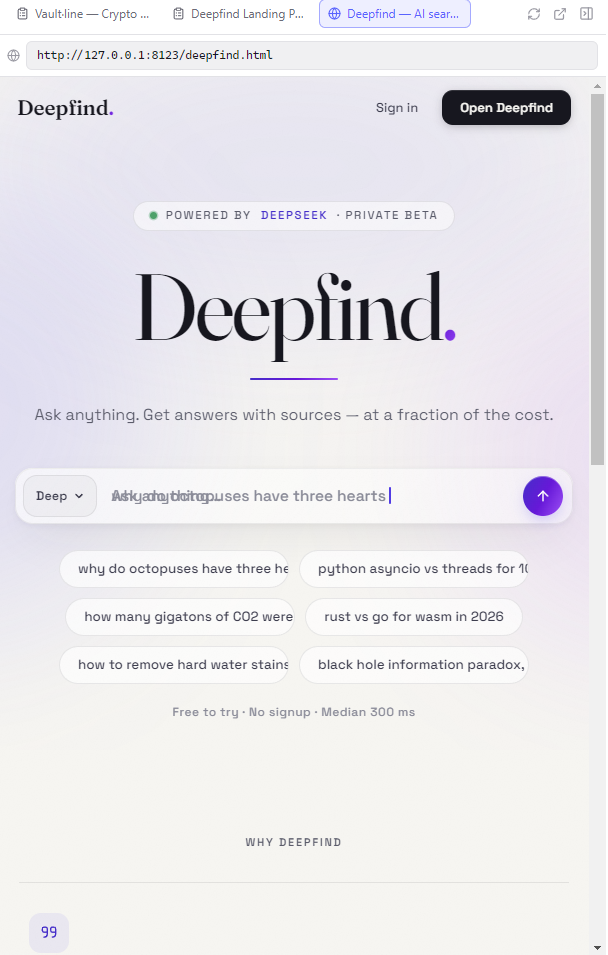
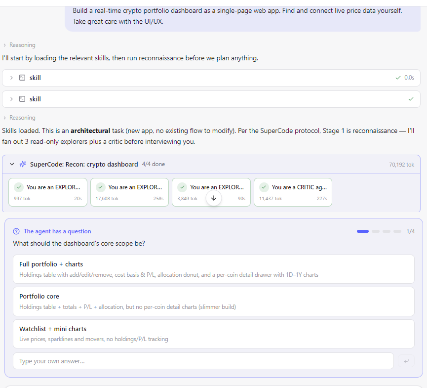
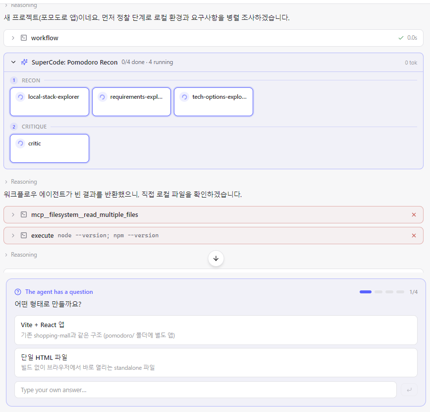
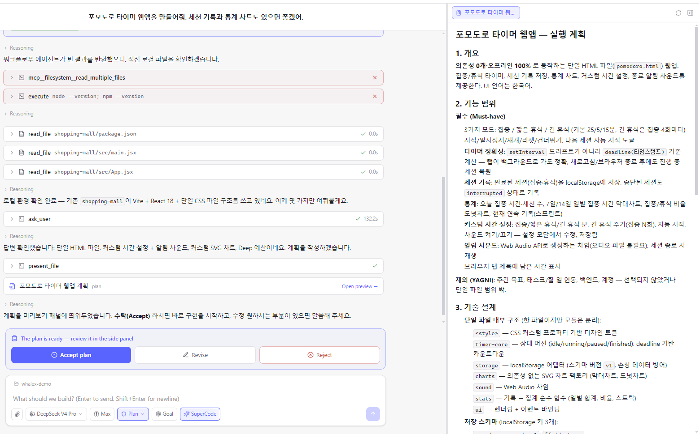
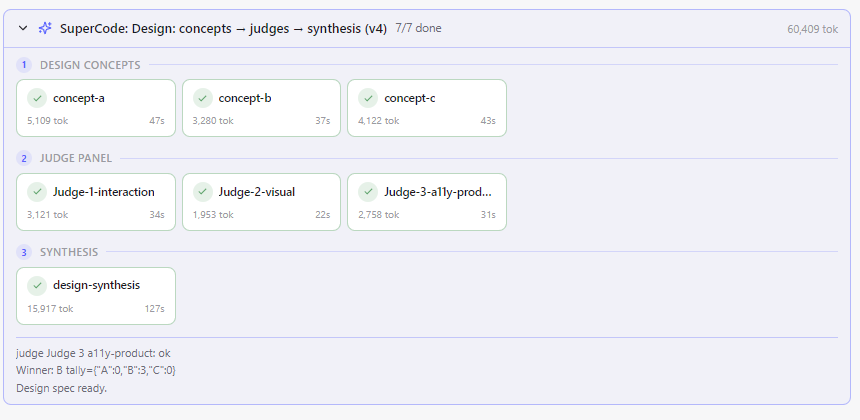
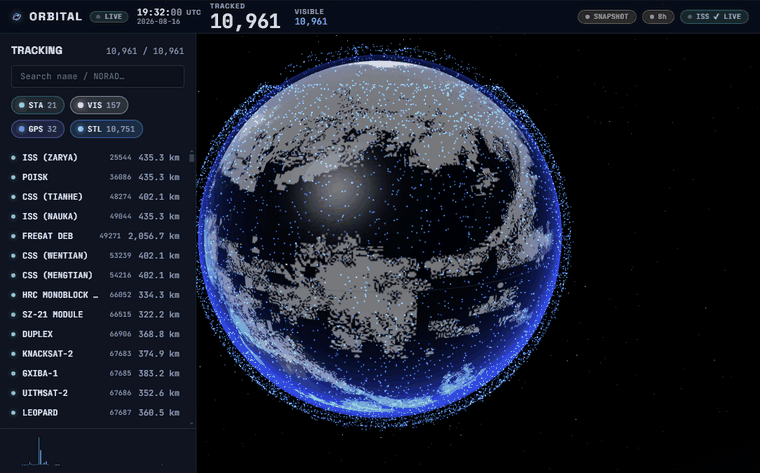
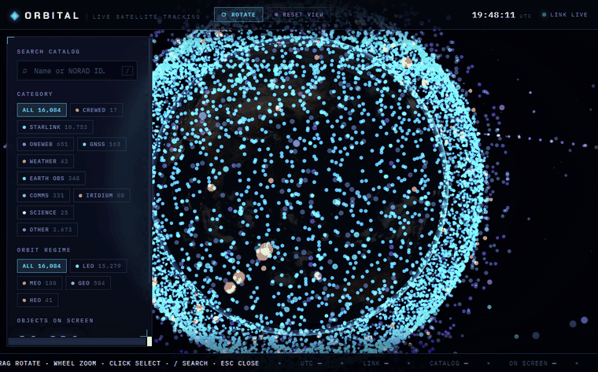

<div align="center">


### A local coding-agent desktop app, powered by DeepSeek

Like **Claude Code** / **Codex** — but it runs on your own DeepSeek key.
Reads, edits and runs code in a folder on your machine, and shows you what it built in a live preview.

[](https://github.com/leejoong/whalex/releases)
[](LICENSE)
[](https://github.com/leejoong/whalex/releases)
[](https://platform.deepseek.com)
[](#-languages)

<br>


<sub><em>Built by WhaleX from a single prompt and self-verified with its own <code>verify_page</code> tool: a NASA-textured Earth with a live 8-satellite constellation, orbit tracks, altitude HUD and ground stations. About four cents of DeepSeek tokens.</em></sub>

</div>

---

## 🐳 What is WhaleX?

WhaleX is an open-source **coding-agent desktop app in the mould of Claude Code and Codex,
running on your own DeepSeek API key**. You point it at a folder and talk to it; it reads,
writes and runs code there, opens what it built in a live preview, and asks before doing
anything risky.

Three ideas drive it:

1. **Local-first.** Everything happens on your machine — your files, your shell, your key
   (stored with OS-level encryption). No account, no telemetry, no middleman.
2. **Verify, don't hope.** The agent renders its own HTML in a real browser engine, reads
   consoles and DOMs, and measures whether an animation actually moves before calling a job
   done.
3. **Cheap enough to be bold.** DeepSeek tokens cost 1–2% of frontier rates, so agent fleets
   (SuperCode), goal loops and heavy iteration are everyday tools rather than splurges —
   the [benchmark below](#-measured-against-codex-and-claude-code) puts numbers on it.

## ✨ What it does

| | | |
|---|---|---|
| 🛠 **Local control** | Read, write and edit files; run PowerShell or bash; `glob`, `grep`, `web_fetch` — all scoped to your project folder. | |
| 🎨 **Artifact preview** | HTML, SVG, Mermaid and Markdown the agent creates render in a split panel, hot-reloading as it edits. | `present_file` |
| ✅ **Self-verification** | `verify_page` opens a page it built in a real browser engine and measures whether it actually draws and animates — so a blank canvas gets caught and fixed, not shipped. | `verify_page` |
| 🌐 **Browser use** | Reads pages through the DOM and the accessibility tree, so it can build and test web apps even though DeepSeek is text-only. | `browser_*` |
| 🤖 **Sub-agents** | Delegates a scoped job to a child agent with its own context — or fans out a fleet of them in parallel. | `agent`, SuperCode |
| 🎯 **Goal mode** | Give it a goal instead of a task; it iterates and self-assesses until the goal is met. | Codex-style loop |
| ⏪ **Checkpoints** | `/rewind` restores your files *and* the conversation to any earlier turn. | `/rewind` |
| 🔌 **Extensible** | One-click MCP presets, `SKILL.md` skills, git or local plugins, and shell Hooks on tool events. | MCP · Skills · Plugins |
| 🖼 **Vision bridge** | Paste an image and a vision model you connect describes it into context — DeepSeek never has to see pixels. | optional |
| ⚡ **Fast &amp; current** | Read-only tools run in parallel, rate limits retry themselves, and the app updates itself in place. | auto-update |

## 📸 In action

| One prompt → a shipped landing page, verified in-app | The interview — decisions stay yours, step by step |
|---|---|
|  |  |
| **Browser use — searches Google, reads the results back** | **Thinking effort — click the level, drag the slider** |
|  |  |

## 🚀 Quick start

### Install

Grab your OS installer from **[Releases](https://github.com/leejoong/whalex/releases)** —
step-by-step instructions per OS are [at the bottom of this page](#-installing-per-os).
Then launch it: **paste your [DeepSeek API key](https://platform.deepseek.com/api_keys) →
pick a folder → go.**

### Or build from source

```bash
git clone https://github.com/leejoong/whalex && cd whalex
pnpm install
pnpm dev        # launch the desktop app (run from the repo root)
```

Requirements: **Node ≥ 20**, **pnpm 9**, a **DeepSeek API key**.

## 🧭 How it works


Every write or command is gated by a **permission card** unless you switch modes. Cycle modes with **Shift+Tab**:

| Mode | Behavior |
|---|---|
| **Ask** (default) | Confirm every write / command |
| **Auto-edit** | Auto-approve file edits, still ask for shell |
| **Plan** | Read-only — the agent plans without changing anything |
| **Auto** | Approve everything (a warning banner stays on) |
| **SuperCode** | The orchestration mode picks for you: strongest model + max reasoning + plan mode for recon and interview, then Auto the moment you accept the plan |

## 📊 Measured against Codex and Claude Code

Five tasks, same prompts, all three CLIs running full-auto on the same Windows machine. Tokens come from each
tool's own usage report; cost is computed from published rates. Artifacts were **rendered in a
real browser engine** to confirm they work — not just that a file was written.

<p align="center">
  
</p>

<p align="center">
  
</p>

<details>
<summary>Raw numbers (table)</summary>

<table>
<thead>
<tr>
  <th rowspan="2" align="left">Task</th>
  <th colspan="3">⏱ Time</th>
  <th colspan="3">💵 Cost</th>
</tr>
<tr>
  <th>🐋 WhaleX</th><th>Codex</th><th>Claude&nbsp;Code</th>
  <th>🐋 WhaleX</th><th>Codex</th><th>Claude&nbsp;Code</th>
</tr>
</thead>
<tbody>
<tr>
  <td align="left"><b>Steam locomotive</b><br><sub>canvas animation, night scene</sub></td>
  <td align="right"><b>6m 48s</b></td><td align="right">7m 24s</td><td align="right">14m 18s</td>
  <td align="right"><b>$0.035</b></td><td align="right">$1.11</td><td align="right">$4.35</td>
</tr>
<tr>
  <td align="left"><b>Realistic 3D Earth</b><br><sub>WebGL globe, day/night</sub></td>
  <td align="right"><b>6m 37s</b></td><td align="right">5m 54s</td><td align="right">25m+ <sub>capped</sub></td>
  <td align="right"><b>$0.035</b></td><td align="right">$1.34</td><td align="right">~$7.23<sup>*</sup></td>
</tr>
<tr>
  <td align="left"><b>E-commerce landing page</b><br><sub>single-file storefront</sub></td>
  <td align="right"><b>2m 16s</b></td><td align="right">11m 24s</td><td align="right">3m 59s</td>
  <td align="right"><b>$0.015</b></td><td align="right">$2.41</td><td align="right">$0.93</td>
</tr>
<tr>
  <td align="left"><b>LeetCode classics</b><br><sub>7 problems · 48 hidden tests · all three scored 100%</sub></td>
  <td align="right"><b>20s</b></td><td align="right">1m 08s</td><td align="right">38s</td>
  <td align="right"><b>$0.003</b></td><td align="right">$0.214</td><td align="right">$0.187</td>
</tr>
<tr>
  <td align="left"><b>Spreadsheet formula engine</b><br><sub>parser · error propagation · circular refs · 71 hidden cases · all three scored 100%</sub></td>
  <td align="right"><b>8m 34s</b><sup>†</sup></td><td align="right">11m 56s</td><td align="right">6m 39s</td>
  <td align="right"><b>$0.048</b></td><td align="right">$2.23</td><td align="right">$1.40</td>
</tr>
<tr>
  <th align="left">All five</th>
  <th align="right">32m 49s</th><th align="right">37m 45s</th><th align="right">50m 34s</th>
  <th align="right">$0.135</th><th align="right">$7.30<br><sub>54×</sub></th><th align="right">~$14.10<br><sub>104×</sub></th>
</tr>
</tbody>
</table>

</details>

Two tasks carry an objective score, and **all three agents scored 100% on both** — including the
spreadsheet engine, which wants a real parser, error propagation, circular-reference detection and
dependency-ordered recalculation across 71 hidden cases. That is the honest headline: on a
well-specified task these agents all produce correct work, so the table reports time and cost
rather than a column of identical 100%s. The visual tasks are judged by rendering them (below).

DeepSeek's per-token price is what opens the gap: **$0.435/$0.87** per 1M in/out against
**$5/$25** (Opus 5) and **$5/$30** (GPT-5.6 Sol).

### Same prompt, three results

<sub>"Create a single-file HTML/CSS/JS animation of a steam locomotive moving through a night scene —
spinning wheels with connecting rods, steam puffing from the chimney, glowing furnace light, sparks
flying from the track, seamless loop."</sub>

| 🐋 WhaleX · **$0.035** | Codex · $1.11 | Claude Code · $4.35 |
|---|---|---|
|  |  |  |

<sub>"Create a realistic 3D HTML animation of the Earth."</sub>

| 🐋 WhaleX · **$0.035** | Codex · $1.34 | Claude Code · ~$7.23\* |
|---|---|---|
|  |  |  |

<sub>"Build a modern landing page for an online shopping mall as a single self-contained file."</sub>

| 🐋 WhaleX · **$0.015** | Codex · $2.41 | Claude Code · $0.93 |
|---|---|---|
|  |  |  |

<sub>**Method.** All three CLIs ran full-auto with identical prompts on the same machine; every
visual artifact was rendered in a real browser engine and checked with `verify_page` before
scoring. Token counts come from each tool's own usage report.
**†** Completed run measured on a second machine. **\*** Estimated from the session transcript
(the run passed a 25-minute cap; its artifact scores 100%). One run per task — enough to show
order-of-magnitude cost differences, not to rank model intelligence. Rates verified 16 Aug 2026.
Full write-up: [docs/bench/report.html](docs/bench/report.html).</sub>

## 🐳 SuperCode — Ultracode-class orchestration at DeepSeek prices

Frontier coding agents ship an orchestration mode where the model reasons at maximum
depth and dynamically organizes tens to hundreds of sub-agents around one problem.
**SuperCode is that mode built on DeepSeek** — the same shape of work, at token prices
where a large fleet costs cents. Turning it on always runs the same protocol:

**1 · Reconnaissance.** SuperCode starts in plan mode with reasoning pinned to Max.
Before anything else, three explorer agents investigate the task from different angles
in parallel — code and structure, requirements and edge cases, dependencies and risks —
and a critic agent attacks their combined findings for gaps and assumptions.



**2 · Interview, including a budget dial.** The agent asks what genuinely needs your
call — and always asks how much fleet you want: **Economy / Standard / Deep /
Unlimited**. Higher levels buy parallel verification and speed; the agent will also
tell you when a small task doesn't need them.

**3 · A plan that names its fleet.** The plan opens in the side panel and must state
the phases, roughly how many agents each phase runs, and what gets adversarially
verified. Nothing is written until you accept.



**4 · Budget-scaled execution.** After acceptance the orchestrator runs workflow
fleets sized to the accepted budget: one small sharply-scoped agent per file, module,
test target or design alternative; judge panels between competing designs; dedicated
adversarial verifiers on important artifacts; discovery loops that repeat until dry.
The run below is real — three design concepts drafted in parallel, judged by a
three-judge panel (interaction / visual / a11y), winner synthesized into the spec:



The whole pictured session — max-reasoning recon, interview, planning on V4 Pro plus a
multi-phase design fleet — used roughly half a million tokens: about **$0.30** at
DeepSeek rates. The same orchestration pattern on frontier-model pricing is a
double-digit dollar decision.

**Same brief, with and without the fleet.** We gave one prompt — *"Render the
current real-time positions and info of satellites on a 3D Earth. Find and connect
real live data sources yourself. Take great care with the UI/UX."* — to two fresh
sessions on the same model (V4 Pro), same procedure (plan → accept → auto). The
SuperCode run's tracker is also the hero image at the top of this page. Both shipped genuinely excellent, fully-verified trackers — the
difference was how they got there:

| | 🚀 **SuperCode (Deep budget)** | 🧑‍🚀 **Solo agent** |
|---|---|---|
| Result |  |  |
| Active working time | **64 min** | 93 min |
| Tool calls / file writes | 348 / 96 | 294 / 74 |
| Satellites rendered | 10,961 (curated groups) | 16,084 (full catalog) |
| Verification | recon fleet, 3-judge design panel, 6 adversarial findings fixed, a11y audit | self-built pixel-sampling harness; found & fixed real canvas and shader bugs |
| Tokens (est. from session logs) | ~57M (incl. 10.7M measured fleet) | ~23.5M |
| Cost, DeepSeek list price* | ≤ $26 | ≤ $10 |
| Same volume at frontier rates | ~$290 | ~$120 |

<sub>*Upper bound at $0.435/$0.87 per 1M tokens with no cache discount — DeepSeek's
automatic context caching bills repeated prefixes at a fraction of list, so the
real figure is far lower. Frontier column: the same token volume at $5/$25.</sub>

The fleet finished a third faster and verified along more axes at once; the solo
agent went deeper on fewer threads. What makes either affordable enough to run
casually is the pricing: this entire two-session experiment cost less than a
single frontier-priced run of one of them.

**Under the hood** the agent writes a short orchestration script and WhaleX executes it:

```js
// The agent writes this; WhaleX executes it.
phase('Review')
const DIMENSIONS = ['correctness', 'security', 'performance', 'tests']

const findings = await pipeline(
  DIMENSIONS,
  d => agent(`Review this repo for ${d} issues.`, { label: d, schema: FINDINGS }),
  review => parallel(review.findings.map(f => () =>
    agent(`Try to REFUTE this finding: ${f.title}`, { schema: VERDICT })
      .then(v => ({ ...f, real: !v.refuted }))
  ))
)
return findings.flat().filter(f => f.real)
```

| Hook | What it does |
|---|---|
| `agent(prompt, opts)` | Runs a sub-agent. `schema` forces structured JSON back, `label`/`phase` place it in the progress tree. |
| `parallel(thunks)` | Runs tasks concurrently and waits for all of them — a barrier. |
| `pipeline(items, ...stages)` | Runs each item through every stage independently, no barrier between stages. |
| `phase(title)` | Starts a new group in the progress tree. |
| `log(msg)` | Writes a line to the run narration. |

**How it runs safely**

- The script executes with **only those five hooks in scope** — no `require`, no
  `process`, no filesystem, no network. It cannot do anything except ask for agents.
- Fleet agents read and write files but have no shell; **every tool call passes the
  same permission engine** as the main session, so plan mode keeps the whole fleet
  read-only and approvals bubble up to the same cards.
- Hard caps on agent count (400 by default, configurable to 1,000) and concurrency,
  plus a token budget and live cost ticking in the progress card.
- **Explicit opt-in only**: flip the composer switch, type `supercode` in a prompt, or
  run `/supercode on`. It never triggers itself.


## 🧩 Extend it

- **MCP servers** — Settings → MCP has one-click presets (filesystem, memory, sequential-thinking, fetch, GitHub, Playwright, Excel, PowerPoint, Gmail, …). Or paste any `mcpServers` JSON.
- **Skills** — drop a `SKILL.md` under `~/.whalex/skills/<name>/` (Claude Code-compatible).
- **Plugins** — install from a git URL or a local folder (skills + MCP + commands).
- **Hooks** — run shell commands on `PreToolUse` / `PostToolUse` / `UserPromptSubmit` / `Stop`; a `PreToolUse` hook can block a tool.
- **Feature toggles** — turn sub-agents, SuperCode, browser use, web fetch on/off in Settings.

## 🌐 Languages

UI ships in **English** (default), **Korean**, **Chinese**, **Japanese**, and **French** — switch in Settings → Language (or **System** to follow your OS).

## 🧪 Development

```bash
pnpm build          # build core packages
pnpm test           # core unit tests (vitest)
pnpm dev            # run the desktop app (from repo root)
pnpm --filter @whalex/desktop dist   # build an installer into apps/desktop/release/
```

CLI harness (drive the core without Electron):

```bash
DEEPSEEK_API_KEY=sk-... pnpm --filter @whalex/cli start "C:\path\to\project"
```

## 📦 Editions

Built with a `WHALEX_EDITION` flag: **`oss`** (default, BYOK + GitHub auto-update) and **`cloud`** (login + hosted API proxy). See [releasing &amp; signing notes](#-releasing--code-signing).

## 🔏 Releasing &amp; code signing

Push a `v*` tag → GitHub Actions builds Windows / macOS / Linux and publishes a **draft** release. Code signing is applied automatically when secrets are present:

- **Windows** — `WIN_CSC_LINK` / `WIN_CSC_KEY_PASSWORD`, or Azure Trusted Signing (~$10/mo, removes SmartScreen warnings). Free option for OSS: [SignPath.io](https://signpath.io).
- **macOS** — `APPLE_ID` / `APPLE_APP_SPECIFIC_PASSWORD` / `APPLE_TEAM_ID` + `CSC_LINK` (Apple Developer, $99/yr).

## 📝 Notes

- DeepSeek's API is **text-only** — image understanding and computer-use route through an optional vision model you connect yourself.
- Builds aren't code-signed yet, so you'll see an OS warning on first launch.
- This is an independent open-source project, **not** affiliated with Anthropic, OpenAI, or DeepSeek. Claude Code and Codex are trademarks of their respective owners.

## 🔒 Privacy

WhaleX is bring-your-own-key and sends nothing anywhere except the model endpoint you
configure. There is no account, no telemetry, and no middleman server.

- **Secret masking, on by default.** Before any request leaves your machine, WhaleX
  masks secret-shaped strings — API keys, tokens, JWTs, private-key blocks,
  `PASSWORD=`-style assignments — with stable placeholders, so the model can reason
  about "the key in `.env`" without ever seeing its value. Toggle it in Settings →
  General. The model still reads the code it works on; masking targets credentials,
  not your source.
- **Encrypted in transit and at rest.** All API traffic is TLS; your API key is stored
  with the OS keychain (DPAPI on Windows) and never shown to the renderer.
- **Fully local option.** Point the provider at any OpenAI-compatible local server
  (e.g. Ollama at `http://localhost:11434/v1`) and nothing leaves the machine at all.
- Session transcripts and checkpoints live in `~/.whalex/` on your disk, nowhere else.

## 💾 Installing, per OS

### Windows
1. Download **`WhaleX-Setup-0.1.0.exe`** from [Releases](https://github.com/leejoong/whalex/releases).
2. Run it. SmartScreen will warn because the build is unsigned — click **More info → Run anyway**.
3. The app installs per-user (no admin rights needed) and creates Start-menu and desktop shortcuts.
4. First launch: paste your DeepSeek API key, pick a working folder, choose a permission mode.
5. Updates arrive in-app — a toast appears, one click restarts into the new version.

### macOS (Apple Silicon)
1. Download **`WhaleX-0.1.0-arm64-mac.zip`** and unzip it.
2. Drag **WhaleX.app** into **Applications**.
3. The app is unsigned/un-notarised, so plain double-click is blocked: **right-click → Open → Open**
   (needed only once). On newer macOS you may instead need **System Settings → Privacy & Security →
   "Open Anyway"**.
4. First launch: key → folder → go, same as Windows.

### Linux
1. Download **`WhaleX-0.1.0.AppImage`**.
2. Make it executable and run:
   ```bash
   chmod +x WhaleX-0.1.0.AppImage
   ./WhaleX-0.1.0.AppImage
   ```
3. If your distro lacks FUSE 2 (`libfuse.so.2` error): install `libfuse2`, or run with
   `--appimage-extract-and-run`.
4. Optional: use [AppImageLauncher](https://github.com/TheAssassin/AppImageLauncher) for a menu
   entry and desktop integration.

### From source (all platforms)
```bash
git clone https://github.com/leejoong/whalex && cd whalex
pnpm install
pnpm dev                              # run the app in dev mode
pnpm --filter @whalex/desktop dist    # or build an installer
```
Requirements: **Node ≥ 20**, **pnpm 9**, a **DeepSeek API key**.

## 📄 License

MIT — see [LICENSE](LICENSE).

---
