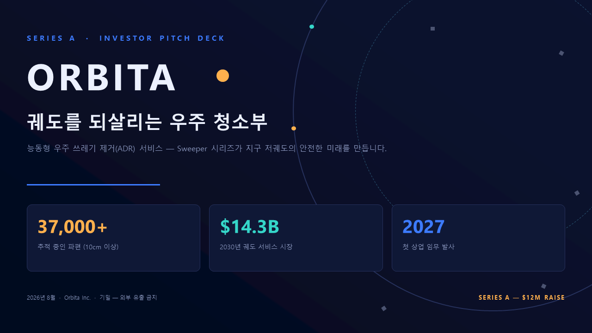
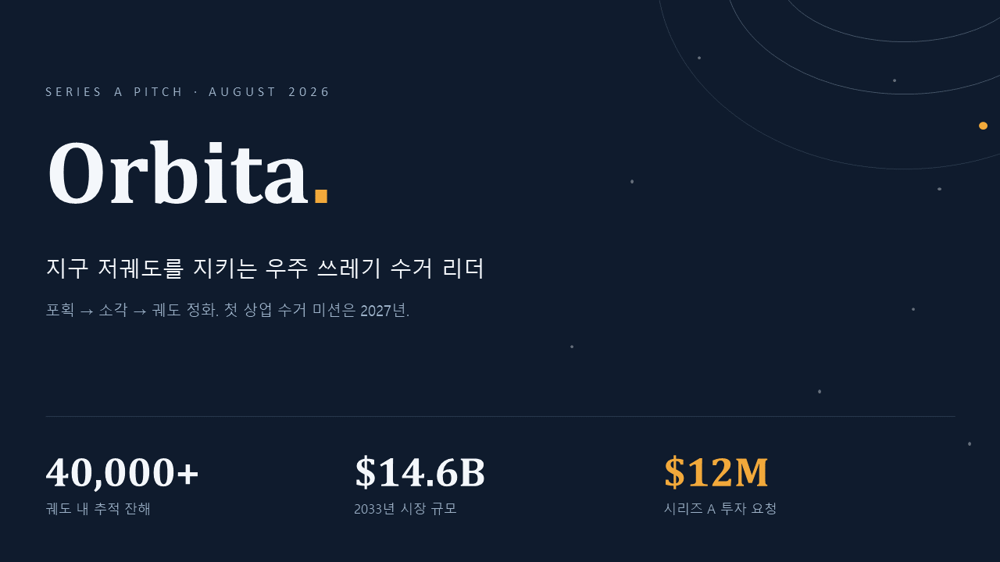
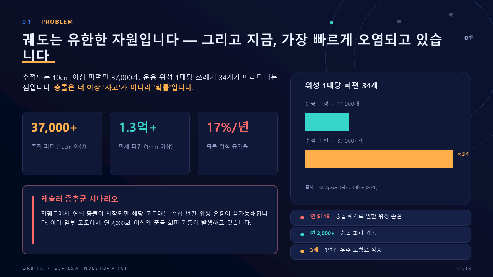
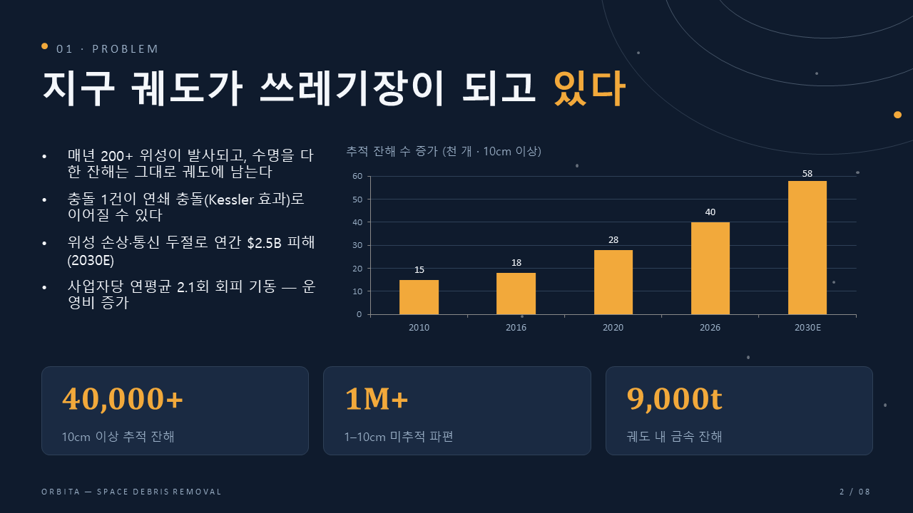
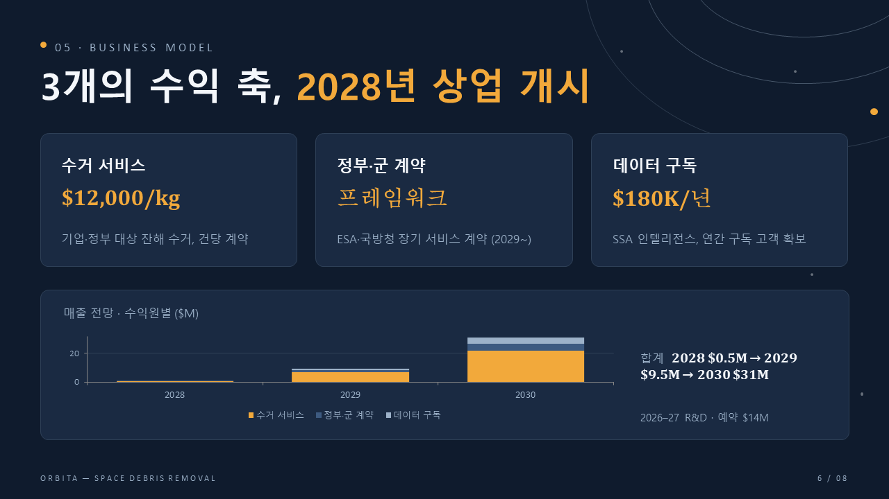

# WhaleX Design

**WhaleX Design** is the built-in design system that makes WhaleX's visual output —
PowerPoint decks, landing pages, posters, styled documents — look deliberately
designed instead of AI-generated. It ships with the app as a pack of default
skills, works with any text-only DeepSeek model, and gets sharper when you
connect a (free) vision model for visual QA.

> TL;DR: the same ideas that make Claude's document output good — skill
> playbooks, design-token consistency, ban-lists of AI tells, and a
> render-and-look QA loop — implemented for a DeepSeek agent, plus a few
> things of our own (dependency-free template theme extraction, CJK-aware
> line-breaking budgets, PowerPoint COM visual QA on Windows).

## The pack

These skills ship enabled by default (Settings → Skills can toggle each):

| Skill | Covers | Origin |
|---|---|---|
| **whalex-design** | .pptx decks: creation, editing, matching an existing template | WhaleX original |
| **frontend-design** | Landing pages, UI, single-file sites | Anthropic (Apache-2.0) + WhaleX additions |
| **canvas-design** | Posters and static art (.png/.pdf), philosophy-first | Anthropic (Apache-2.0) |
| **theme-factory** | 10 preset color/font themes + custom theme generation | Anthropic (Apache-2.0) |
| **docx** / **xlsx** / **pdf** | Word reports, Excel workbooks, designed PDFs — with Office-COM QA on Windows | WhaleX originals |
| **webapp-testing** | Drive real user flows in the built-in browser and report evidence | WhaleX original |
| **systematic-debugging** | Reproduce → localize → one-change experiments | WhaleX original |
| **code-review** | Correctness-first review with verified findings | WhaleX original |

Skills are plain folders with a `SKILL.md` — the system prompt carries a
one-line catalog, and the agent loads the full playbook only when the task
matches. Your own skills in `~/.whalex/skills/<name>/` override a bundled
skill with the same name, so you can fork and customize any of them.

## What actually makes the output good

**1 · A THEME contract, declared before any code.** Every deck or page starts
with one token object — palette (dominant / supporting / accent), type scale,
spacing unit, font stack, one repeating motif — and nothing below it may use a
literal color or size. Same title size on every slide, same gap everywhere.
Consistency is the single biggest difference between "designed" and "generated".

**2 · Match mode for existing files.** Give it a deck and say "add three slides
in this style": a bundled dependency-free extractor
(`whalex-design/scripts/extract-theme.mjs`) reads the .pptx theme — colors,
major/minor fonts, slide size, per-slide font sizes — and those tokens become
the contract. The agent follows your brand instead of "improving" it.

**3 · Ban-lists of AI tells.** No accent underlines beneath titles, no
decorative color bars or edge stripes, no text-only slides, no centered body
text, no cream-beige defaults, no layout repeated twice in a row. Negative
constraints beat "make it beautiful".

**4 · Line-breaking rules for every language.** Display text never auto-wraps
at an arbitrary point — the agent chooses break points at phrase boundaries.
Korean gets `word-break: keep-all` (no mid-word shards), Japanese/Chinese get
strict kinsoku instead, numbers never separate from their units, and deck text
is budgeted per script (Latin ≈ 9.5 chars/inch, CJK ≈ 5.5 at 15pt).

**5 · A render-and-look QA loop.** The agent exports its own slides to PNG
(via PowerPoint COM on Windows) or screenshots its page, then — if a vision
model is connected — inspects every image with the `view_image` tool, asking
specifically about text overflow, overlaps, spacing, and contrast, and fixes
what it finds. DeepSeek's API is text-only, so vision routes through a sidecar
you connect in Settings → Vision; the recommended zero-cost option is Google
Gemini Flash's free tier (a one-click preset). In our test run the vision loop
caught and fixed three real bugs the text-only pass missed — a corrupt
negative-height shape, a line-spacing unit error that overlapped text, and two
text-width overruns.

**6 · Decks render in the app.** `present_file` with `kind: "slides"` opens
the finished .pptx as a real visual render (backgrounds, shapes, charts) in
the artifact panel, with a text-outline fallback for decks the renderer can't
parse.

## Before / after

Same model (deepseek-v4-flash), same prompt, same headless setup — the only
difference is the skill pack (and, in the last column, vision QA):

| Before (no skills) | After (WhaleX Design + vision QA) |
|---|---|
|  |  |
|  |  |

Both columns came from one prompt: *"Series-A pitch deck for a space-debris
startup, 8 slides."* The after column follows a single THEME (Midnight
Editorial: navy `0F1B2D`, amber `F2A93B`, Cambria display), repeats one motif
on every slide, numbers its pages, uses native charts in palette colors — and
was visually QA'd slide-by-slide by the agent itself.

## Using it

Nothing to configure — ask for a deck, a landing page, or a poster and the
matching skill loads itself. Useful extras:

- **Brand consistency**: attach or point at an existing .pptx / brand colors —
  match mode follows them.
- **Vision QA**: Settings → Vision → "Gemini Flash (free tier)" preset + a free
  [Google AI Studio](https://aistudio.google.com/apikey) key. Free-tier rate
  limits (~10 req/min) are handled with pacing built into the skill.
- **Toggle / customize**: Settings → Skills switches any bundled skill off;
  copying a skill folder into `~/.whalex/skills/` overrides it.

## Credits & licenses

`frontend-design`, `canvas-design`, and `theme-factory` derive from
[anthropics/skills](https://github.com/anthropics/skills) (Apache-2.0; license
files ship alongside each skill; `frontend-design` carries WhaleX
modifications). `whalex-design` is a WhaleX original — Anthropic's pptx skill is
source-available (not open source) and is **not** included; whalex-design covers
the same ground with its own playbook, informed by the community's published
lessons about it.
